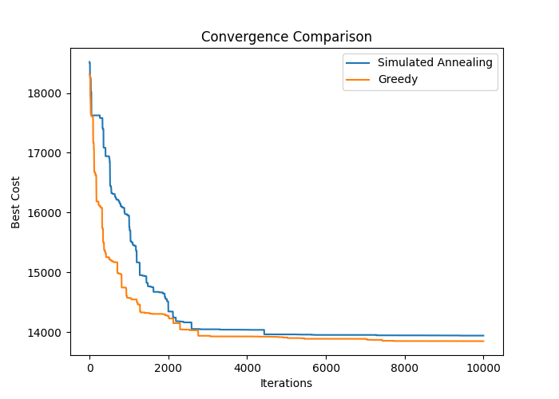
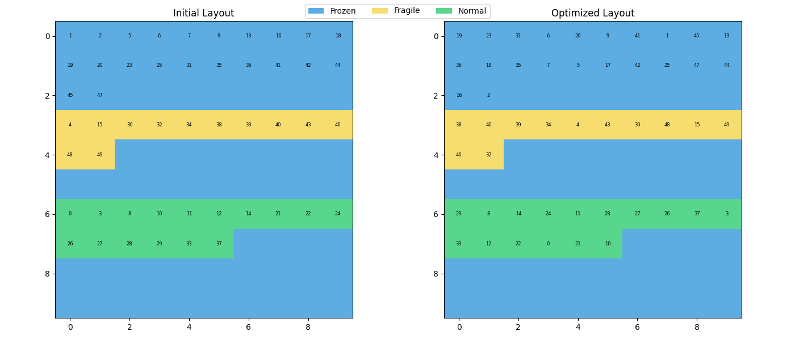
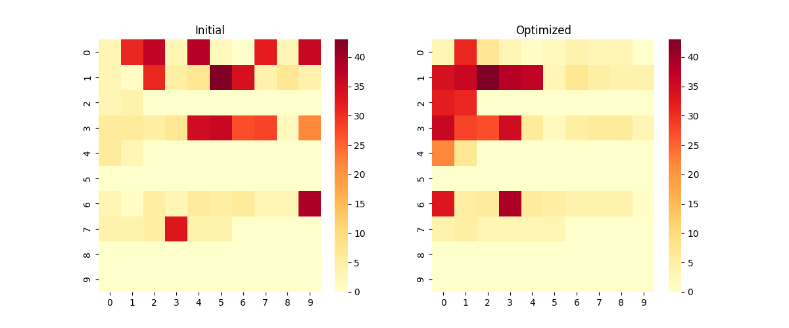
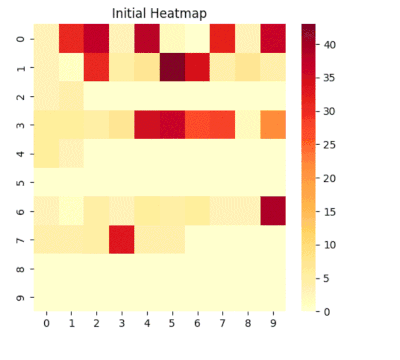

[](https://warehouse-shelf-optimization.streamlit.app/)

# 📦 Warehouse Shelf Optimization

🚀 **Live Demo**
👉 https://warehouse-shelf-optimization.streamlit.app/

---

## 📌 Problem Statement

Optimize warehouse shelf placement to:

* Reduce picker travel distance
* Group frequently co-picked items
* Improve efficiency in order fulfillment

---

## 🧠 Approach

This project models warehouse optimization as a **combinatorial optimization problem**:

* **Simulated Annealing (SA)** → global optimization (escapes local minima)
* **Greedy Algorithm** → fast local search baseline
* **Co-occurrence Matrix** → models how frequently items are purchased together

---

## ⚡ Key Optimization: O(n) Delta Cost Update

Instead of recomputing total cost in **O(n²)** after every swap:

* Uses an **incremental delta cost update in O(n)**
* Only recalculates cost contributions of affected items
* Significantly improves performance during optimization

> This technique is widely used in real-world optimization systems.

---

## 📊 Features

* 🔁 Simulated Annealing vs Greedy comparison
* ⚡ O(n) delta cost optimization
* 📈 Convergence graph visualization
* 🧊 Warehouse layout visualization
* 🔥 Co-occurrence heatmap (input relationships)
* 📍 Distance heatmaps (optimization quality)
* 📊 Improvement % and normalized cost metrics
* 🧪 Real-world dataset support (CSV upload)
* 🎛️ Interactive Streamlit UI

---

## 📊 Results (Real Dataset Evaluation)

The algorithms were evaluated on real market-basket data using cost reduction, average order cost, and co-occurrence distance metrics.

### 🔢 Summary

| Metric                     | Initial | Greedy     | Simulated Annealing |
| -------------------------- | ------- | ---------- | ------------------- |
| Total Cost                 | 18655   | 13848      | 13940               |
| Improvement (%)            | —       | **25.77%** | **25.27%**          |
| Avg Order Cost             | 46.64   | 34.31      | **34.17**           |
| Avg Co-occurrence Distance | 11.03   | **8.26**   | 8.40                |

---

### 📌 Key Observations

* Both **Greedy and Simulated Annealing achieve ~25% cost reduction**
* **Greedy slightly outperforms SA in this run** due to faster convergence
* **Simulated Annealing achieves the lowest average order cost**, indicating better overall layout quality
* SA explores more configurations, while Greedy quickly settles into a local optimum

---

### 🧠 Interpretation

* Greedy performs well when the solution landscape is smooth
* Simulated Annealing is more robust across different datasets
* Performance can vary depending on initialization and parameters

> This highlights the importance of comparing both local and global optimization strategies.


---

## 📊 Visualizations

### 📈 Convergence Comparison



---

### 🧊 Layout Visualization



---

### 🔥 Co-occurrence Heatmap (Input)



---

### 📍 Distance Heatmap (Optimization Quality)

* Shows how well optimized layout places related items closer
* Lower values → better placement
* Helps compare Greedy vs SA visually

---

## 🧪 Dataset

Supports real-world transaction data via CSV upload.

### Required format:

```
order_id,product_id
1,apple
1,milk
2,bread
2,butter
```

* Data is converted into a **co-occurrence matrix**
* Also supports synthetic data for testing

---

## 🛠️ Tech Stack

* Python
* Streamlit
* NumPy
* Pandas
* Matplotlib

---

## 🚀 How to Run Locally

```
git clone https://github.com/Arshanapally-Akshith/warehouse-shelf-optimization.git
cd warehouse-shelf-optimization
pip install -r requirements.txt
streamlit run app.py
```

---

## 🎯 Project Highlights

* Efficient optimization using **O(n) delta cost update**
* Comparison of local vs global optimization strategies
* Real-world data integration
* Strong focus on visualization and interpretability

---

## 📸 Demo



---

## 🚀 Future Improvements

* Multi-floor warehouse optimization
* Demand forecasting integration
* Reinforcement learning-based placement
* Real-time warehouse simulation

---

## 👨‍💻 Author

Built as a portfolio project demonstrating:

* Optimization algorithms
* Performance engineering
* Data-driven system design

---

